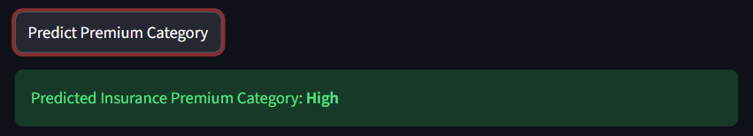

# 🧠 Insurance Premium Category Predictor

## 📌 About the Project
This project predicts the **insurance premium category** (Low / Medium / High) based on user details such as age, BMI, number of children, smoking status, and region.  
It is built using **Machine Learning (Random Forest Classifier)** with a **FastAPI backend** and **Streamlit frontend**.

---

## 🧩 How It Works
1. **Frontend (Streamlit):**  
   Takes input from the user through an interactive UI.  
2. **Backend (FastAPI):**  
   Receives the input via API call and predicts the insurance premium category.  
3. **Machine Learning Model:**  
   The model is trained using historical insurance data to predict the category.  
4. **Response:**  
   The predicted category is displayed instantly on the Streamlit app.

---

## ⚙️ Tech Stack
- Python  
- FastAPI  
- Streamlit  
- Scikit-learn  
- Pandas  
- Pickle (for saving model)

---

## 🚀 How to Run the Project

### Step 1: Clone the Repository
```bash
git clone https://github.com/Shubs09/insurance-premium-predictor.git
cd insurance-premium-predictor
```


### Step 2: Create Virtual Environment
python -m venv venv
venv\Scripts\activate     # On Windows
### OR
source venv/bin/activate  # On Mac/Linux

### Step 3: Install Dependencies
pip install -r requirements.txt

### Step 4: Run FastAPI
uvicorn main:app --reload

### Step 5: Run Streamlit
streamlit run frontend.py


## 📸 Project Screenshots


### 🏠 App Homepage


### 📊 Prediction Result Example

